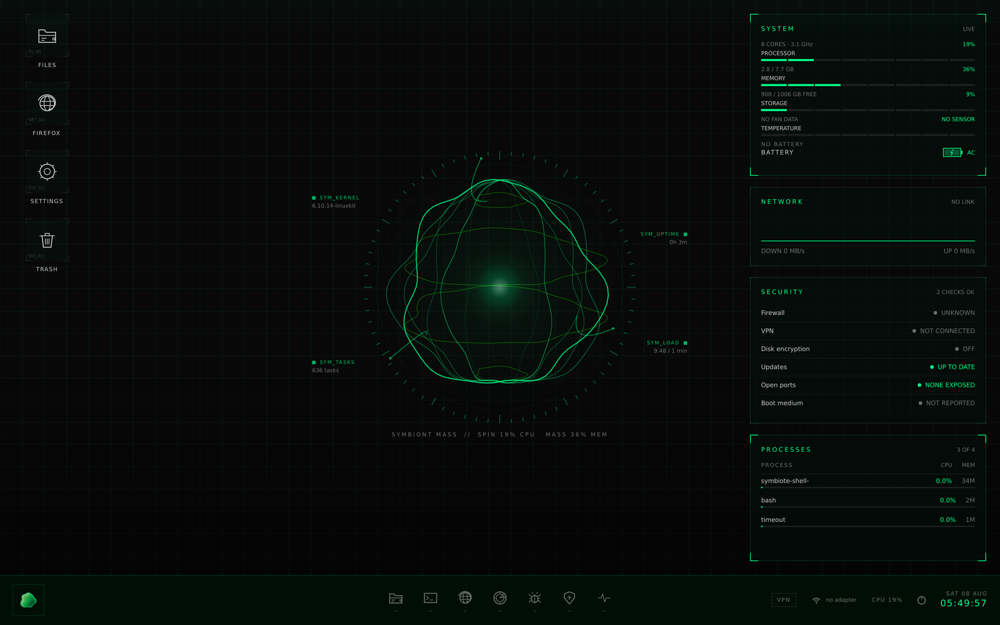
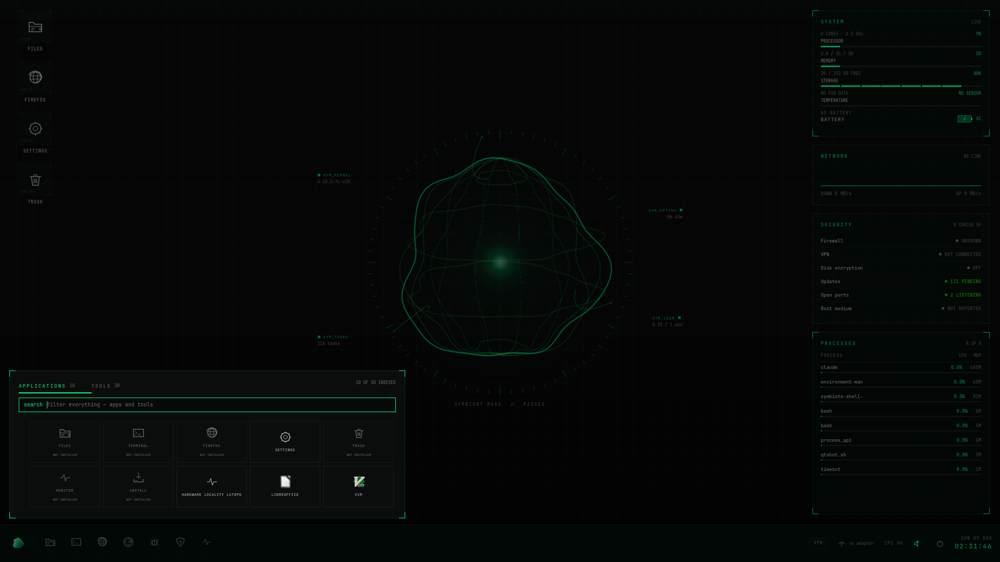
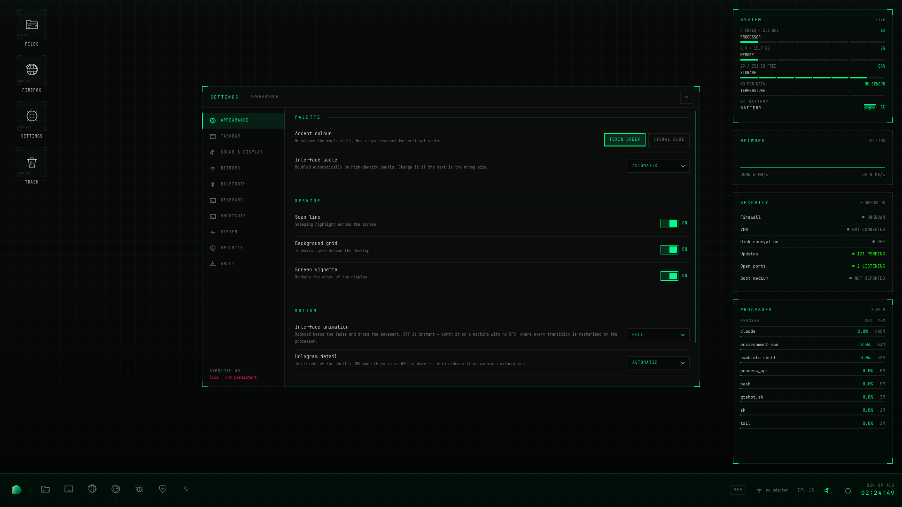
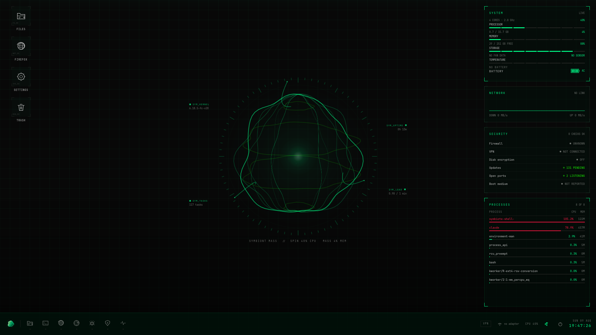

<p align="center">
  
</p>

<p align="center">
  A Debian live distribution with a cinematic FUI desktop shell, built for
  security work and programming.<br>
  <sub>MIT OR GPL-3.0-or-later · Qt 6 / QML · Wayland</sub>
</p>

<p align="center">
  <a href="https://github.com/Ian-XG/symbiote-os/releases/latest"><b>Download the ISO</b></a>
</p>



Every number on that screen is measured. There is no placeholder data anywhere
in the interface: where a value cannot be read, the panel says so rather than
inventing one. The mass in the middle turns at the speed of the processor and
swells with memory in use, and the caption underneath says which — an
interface that encodes data without naming it is just a prettier kind of noise.

Free software, dual licensed under MIT or GPL-3.0-or-later at your option. The
desktop shell, the live-build configuration and the session scripts here are
all original work; the system underneath is Debian and the daemons the shell
talks to — NetworkManager, BlueZ, UPower, PipeWire — are theirs, not
reimplemented here.

**Dual-use.** The image ships penetration-testing tools. They are for systems
you own or have written permission to test. The software does not and cannot
know what you are authorised to touch.

The visual design originates in a Claude Design project (`../symbiote-os-design`);
this repository turns it into an operating system that boots.

## What it looks like

| | |
| --- | --- |
|  |  |
| The launcher reads the system's real desktop entries, grouped. | Nine sections, and every control acts on something. |



The whole shell recolours from one property. Red stays reserved for states
that are genuinely critical.

## Architecture

```
  greetd  ──autologin──▶  labwc (Wayland compositor)
                              │
                              ▼
                     Symbiote Shell (Qt 6 / QML)
                     ├── QtDBus ──▶ NetworkManager   (Wi-Fi)
                     │              BlueZ            (Bluetooth + pairing agent)
                     │              UPower           (battery)
                     │              logind           (shutdown / restart)
                     └── procfs ──▶ /proc, /sys      (CPU, RAM, thermal, processes)
```

**Wi-Fi and Bluetooth are not reimplemented.** Linux already has NetworkManager
and BlueZ. The shell is a *client* of those daemons over D-Bus, which is what
makes the project tractable at all.

`labwc` was chosen over `cage` once the shell needed to host other windows:
cage displays exactly one fullscreen surface, so a file manager or a browser
had nowhere to go.

### Why Qt instead of Electron

The first shell was Electron. It worked, and it cost 331 MB of RAM across two
processes and a full CPU core to animate one hologram. The Qt port does the
same job in a 3.8 MB binary at ~118 MB. The Electron tree is still in `shell/`
and will be removed once Qt has been proven on real hardware for a while.

## Layout

| Path | What |
| --- | --- |
| `shell-qt/` | The desktop shell: C++ services, QML interface |
| `distro/` | live-build configuration — packages, hooks, session scripts |
| `shell/` | The retired Electron shell, kept until the Qt one is trusted |
| `build.sh` | Runs inside the build container; produces the ISO |
| `Makefile` | Everything you actually invoke |
| `docs/img/` | The screenshots above, rendered headlessly by `make qt-shot` |

## Building

Requires Docker. live-build mounts loop devices and bind-mounts inside a
chroot, so the build container is `--privileged`; nothing persists from it but
the ISO.

```sh
make iso          # full ISO, ~25 min
make qt-check     # compile the shell and confirm the QML loads, ~3 min
make qt-shot      # render the shell headlessly to shot.png, ~3 min
make vm-run       # boot the ISO in VirtualBox
```

`make qt-shot` exists because looking at the design used to mean building an
ISO and booting a VM — 25 minutes to discover a hologram was invisible. It
renders the same scene graph offscreen in about three.

```sh
QTSCALE=2 SIZE=1440x900 make qt-shot   # as it looks on a HiDPI panel
OPEN=settings make qt-shot             # with a panel open
ACCENT=signal make qt-shot             # in the blue accent
```

## Running it

Ready-made images are on the [releases
page](https://github.com/Ian-XG/symbiote-os/releases). Verify what you
downloaded before writing it to anything:

```sh
shasum -a 256 -c SHA256SUMS
```

Flash the ISO to a USB stick (Balena Etcher works; the image is isohybrid).
User and password are both `symbiote` — the documented default of a live
image, as with any live distribution. Change it if the stick leaves your desk.

Kernel command line options, for when the defaults guess wrong:

| Option | Effect |
| --- | --- |
| `symbiote.gl=sw` | Force software rendering (blank screen on boot) |
| `symbiote.gl=hw` | Force hardware rendering |
| `symbiote.scale=2` | Force the interface scale |
| `symbiote.drm=card1` | Pick a specific GPU on a dual-GPU machine |
| `symbiote.shell=electron` | Boot the old Electron shell |

If the desktop does not appear, Ctrl+Alt+F2 gives a terminal. The logs are
`/tmp/symbiote-session.log` (which GPU was chosen, at what scale) and
`/tmp/symbiote-shell.log`.

## Persistence

A live image forgets everything on reboot. To keep settings and files, give it
a partition:

```sh
sudo symbiote-persist list
sudo symbiote-persist init /dev/sdX3          # or --luks to encrypt it
```

Settings state plainly whether persistence is active, because settings that
quietly evaporate are worse than settings that tell you they will.

## Security posture

- Inbound traffic is denied by default (`nftables`); outbound is unrestricted,
  since the toolset exists to reach out. Established connections come back in.
- AppArmor profiles are enabled.
- SSH is masked. There is no remote entry point.
- polkit grants the operator NetworkManager, BlueZ, udisks2 and shutdown —
  scoped to those, not a blanket yes. Without it the desktop could scan for
  Wi-Fi networks and never join one, because greetd starts the session through
  seatd rather than logind and polkit saw no active session.
- Autologin is on and the password is a published default. This is a live
  image for a laptop you carry, not a server.

## Known gaps

- No installer. The system runs from the medium; persistence is the answer for
  now.
- APFS-formatted drives cannot be read. exFAT and NTFS work.
- Bluetooth on a Mac needs a Broadcom firmware blob that Debian cannot
  redistribute; a USB dongle works without it.
- Legacy Bluetooth pairing that requires typing a PIN is rejected with an
  explicit message rather than a guessed `0000`.

## Licence

`SPDX-License-Identifier: MIT OR GPL-3.0-or-later` — take it under either, at
your option. See [LICENSE](LICENSE) for what that covers and what it does not.

Worth knowing before you rely on the GPL half: when a work is offered under
*either* licence, a recipient can simply choose MIT. Dual licensing this way
does not keep derivatives open — it permits closed ones. That is a fine
choice; it is just not copyleft.
